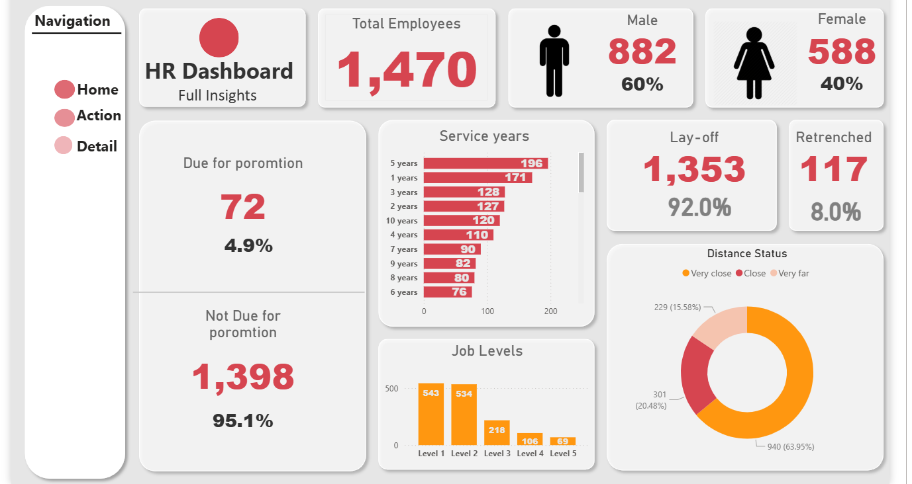
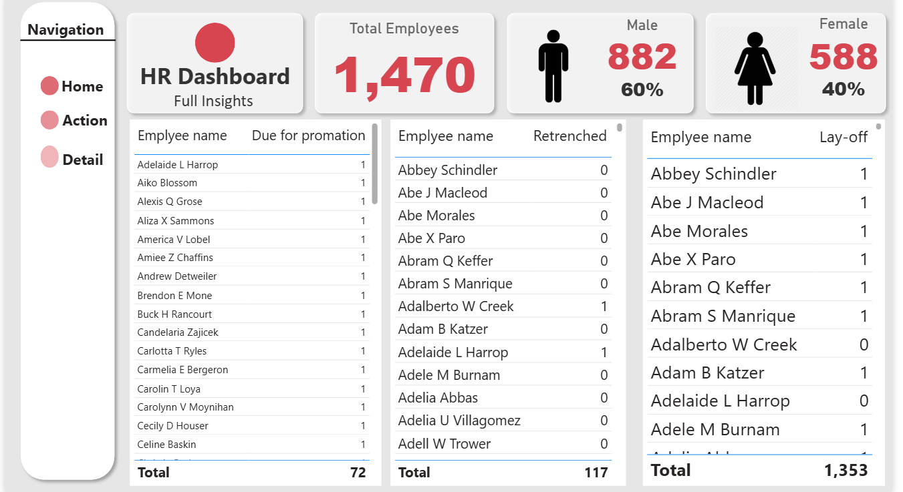
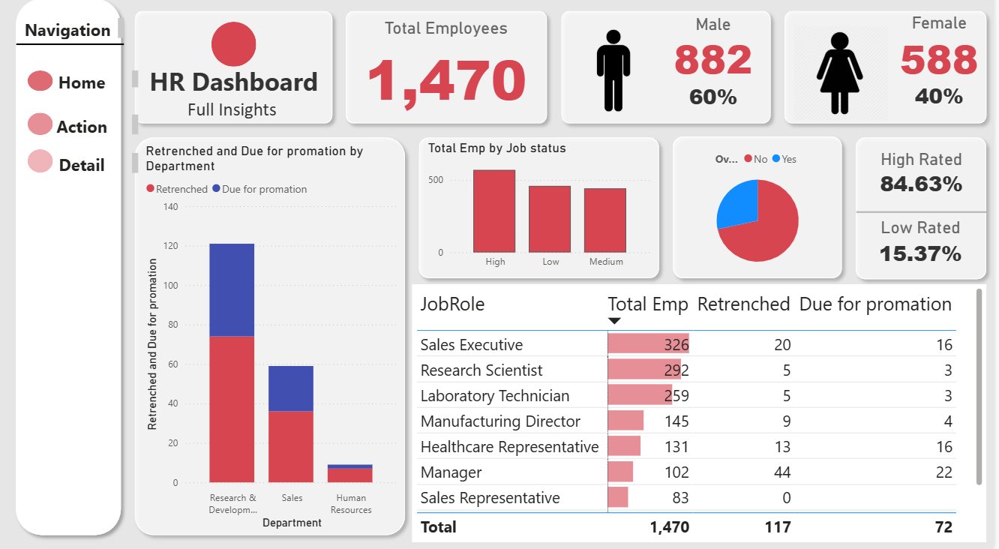

# HR Dashboard Project

This project presents a *Power BI HR Dashboard* for visualizing Human Resources data.  
The dashboard provides insights into employee distribution, gender ratio, service years, job levels, layoffs/retrenchments, and promotion eligibility.  

---

## 📊 Analysis
- Total Employees overview  
- Gender distribution (Male/Female ratio)  
- Lay-off and Retrenched statistics  
- Employee Service Years  
- Job Levels distribution  
- Department-wise analysis  
- Promotion eligibility insights  

---

## 🔑 Key Concepts Used
- Power BI built-in visualization tools  
- DAX Measures & Calculated Columns  
- Cards, Tables, Pie Charts, and Bar Charts  
- Drill-through and Navigation pages  
- KPI Analysis  

---

## 🖼 Outputs (Dashboard Screenshots)

### 1. Overview Page

### 2. Employee Details & Status

### 3. Department-wise Analysis

---

## 📝 Notes
- The data is based on a sample dataset for demonstration purposes.  
- The dashboard is designed to help HR managers make faster, data-driven decisions.  
- Built as both an *analytical tool* and a *practical HR solution*.  

---

## 👤 About Me
I am *[Your Name]*, a Data Analyst / BI Developer.  
- Interests: Data Visualization, Business Intelligence, HR Analytics  
- Contact: [your.email@example.com]  

---
